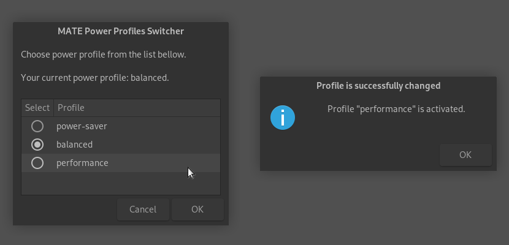

# MATE Power Profiles Switcher
Simple power profiles switcher (depends on `powerprofilesctl`) for **MATE Desktop Environment**.

Written in pure **BASH**, require nothing except of `power-profiles-daemon` and `zenity`.



## Description

This script provides only simple zenity-based GUI and has no tray icon or any other control options (but you always can pin script launcher to panel, if you want).

**Tested only on Debian 12 Bookworm with MATE**.

## Installation
Installation available via `install.sh`.\
It can be runned from GitHub directly, using command below.
```
bash <(wget -qO- https://raw.githubusercontent.com/podbolotov/MATE-Power-Profiles-Switcher/refs/heads/main/install.sh)

```
Installer will create hidden directory in your `$HOME`, download script and create launcher in Applications menu. 

## Uninstallation
1. Remove directory `.mate-power-profiles-switcher` from your `$HOME`. 
2. Remove file `mate-power-profiles-switcher.desktop` from `$HOME/.local/share/applications`.
